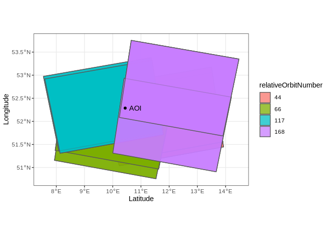
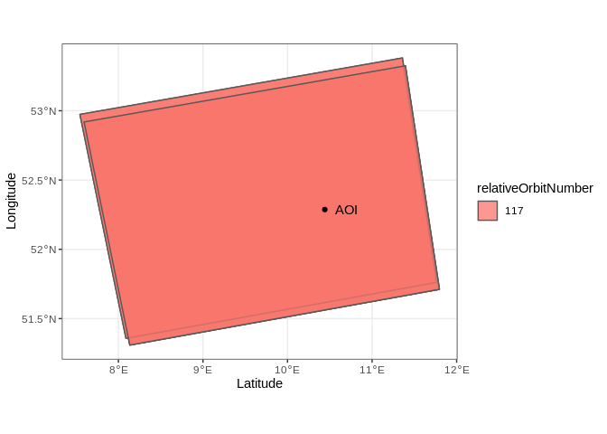
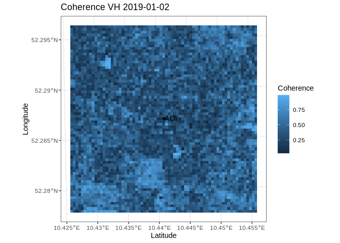

<!-- README.md is generated from README.Rmd. Please edit that file -->

# rcodede

<!-- badges: start -->

<!-- badges: end -->

This package is in the earliest stages of development and is in no way
ready for use.

The goal of rcodede is to simplify the usage of the
[CODE-DE](https://code-de.org/) satellite data repository with R and
provide functions for basic processing steps with the esa SNAP Graph
Processing Tool.

## Installation

You can install the development version from
[GitHub](https://github.com/) with:

``` r
install.packages("devtools")
devtools::install_github("felixlobert/rcodede")
```

If the function for the processing of satellite data shall be used, [esa
SNAP](http://step.esa.int/main/download/snap-download/) has to be
installed on the system and the SNAP Graph Processing tool (GPT) has to
be executable from the command line. You can check this by typing “gpt”
to the command line. If the console shows the GPT context menu, you are
ready to go.

## Examples

### Query available scenes

This is a basic example which shows you how to query available
Sentinel-1 scenes for a given area of interest and multiple filter
criteria. The function ‘rcodede::getScenes’ creates an HTTP-GET request
for the CODE-DE EO Finder API and processes the results for an easy
usage.

``` r
# load simple features library
library(sf)

# Create example AOI
aoi <- c(10.441054, 52.286959) %>%
  sf::st_point() %>%
  sf::st_sfc(crs = 4326)

# load rcodede package
library(rcodede)

# Query footprint and metadata of available scenes for the AOI and given criteria
scenes <-
  getScenes(
    aoi = aoi,
    bufferDist = 100,
    startDate = "2019-01-01",
    endDate = "2019-01-31",
    productType = "SLC",
    view = FALSE
  )

# load ggplot library
library(ggplot2)

# plot queried scenes and AOI
ggplot(scenes) +
  geom_sf(aes(fill = factor(relativeOrbitNumber)), alpha = .75) +
  geom_sf(data = aoi) +
  geom_sf_text(data = aoi,
               label = "AOI", nudge_x = .35) +
  labs(x = "Latitude", y = "Longitude", fill = "relativeOrbitNumber") +
  theme_bw()
```



This table shows the 5 top entries of the resulting sf object:

| date       | platform | orbitDirection | relativeOrbitNumber | centroidLat | centroidLon | productPath                                                                                                             | numberAoiGeoms | footprint                    |
| :--------- | :------- | :------------- | ------------------: | ----------: | ----------: | :---------------------------------------------------------------------------------------------------------------------- | -------------: | :--------------------------- |
| 2019-01-02 | S1B      | ascending      |                 117 |    52.32027 |    9.727361 | /codede/Sentinel-1/SAR/SLC/2019/01/02/S1B\_IW\_SLC\_\_1SDV\_20190102T170751\_20190102T170818\_014318\_01AA3A\_FF22.SAFE |              1 | POLYGON ((7.595577 52.91906… |
| 2019-01-03 | S1A      | ascending      |                  44 |    52.16575 |   11.819360 | /codede/Sentinel-1/SAR/SLC/2019/01/03/S1A\_IW\_SLC\_\_1SDV\_20190103T170016\_20190103T170044\_025316\_02CD10\_3344.SAFE |              1 | POLYGON ((9.6748 52.76576, … |
| 2019-01-05 | S1A      | descending     |                  66 |    51.98302 |   10.031724 | /codede/Sentinel-1/SAR/SLC/2019/01/05/S1A\_IW\_SLC\_\_1SDV\_20190105T053336\_20190105T053403\_025338\_02CDE5\_DD48.SAFE |              1 | POLYGON ((11.62581 50.96621… |
| 2019-01-06 | S1B      | descending     |                 168 |    52.72275 |   12.320578 | /codede/Sentinel-1/SAR/SLC/2019/01/06/S1B\_IW\_SLC\_\_1SDV\_20190106T052428\_20190106T052456\_014369\_01ABD6\_2CFC.SAFE |              1 | POLYGON ((13.9049 51.68368,… |
| 2019-01-08 | S1A      | ascending      |                 117 |    52.37313 |    9.685434 | /codede/Sentinel-1/SAR/SLC/2019/01/08/S1A\_IW\_SLC\_\_1SDV\_20190108T170833\_20190108T170900\_025389\_02CFCA\_312E.SAFE |              1 | POLYGON ((7.54464 52.97379,… |

### Basic Processing

If the CODE-DE satellite data repository is mounted to the used machine,
processing steps can be directly executed to the queried scenes.

The next example shows the estimation of the interferometric coherence
for a selected swath based on two subsequent Sentinel-1 scenes from the
same relative orbit. The function ‘rcodede::estimateCoherence’ creates a
command for the esa SNAP Graph Processing Tool that is executed in the
terminal. A pre-built SNAP-Workflow delivered with the package is then
applied to the selected scenes.

``` r
# filter for scenes from same orbit to ensure same acquisition geometry
scenes.filtered <-
  scenes %>%
  dplyr::filter(relativeOrbitNumber == 117)

# plot filtered scenes
ggplot(scenes.filtered) +
  geom_sf(aes(fill = factor(relativeOrbitNumber)), alpha = .75) +
  geom_sf(data = aoi) +
  geom_sf_text(data = aoi,
               label = "AOI",
               nudge_x = .25) +
  labs(x = "Latitude", y = "Longitude", fill = "relativeOrbitNumber") +
  theme_bw()
```


Estimate the interferometric coherence for the first pair from the
filtered scenes.

``` r
# estimate the coherence for the first two scenes in the sf object
coherence <-
  estimateCoherence(
    master = scenes.filtered$productPath[1],
    slave = scenes.filtered$productPath[2],
    outputDirectory = "/home/",
    fileName = "coherence.tif",
    polarisation = "VH",
    swath = "all",
    aoi = aoi,
    aoiBuffer = 1000,
    numCores = 6,
    maxMemory = 32,
    execute = TRUE,
    return = TRUE
  )
```

The created coherence raster or stack can then be plotted or further
processed:

``` r
# plot the returned coherence raster
ggplot() +
  geom_raster(data = coherence %>% raster::as.data.frame(xy = TRUE),
              aes(x = x, y = y, fill = layer)) +
  geom_sf(data = aoi %>% st_transform(st_crs(coherence)),
          show.legend = "AOI") +
  geom_sf_text(
    data = aoi %>% st_transform(st_crs(coherence)),
    label = "AOI",
    nudge_x = 75
  ) +
  labs(
    x = "Latitude",
    y = "Longitude",
    fill = "Coherence",
    title = paste0("Coherence VH ", scenes.filtered$date[1])
  ) +
  theme_bw()
```


